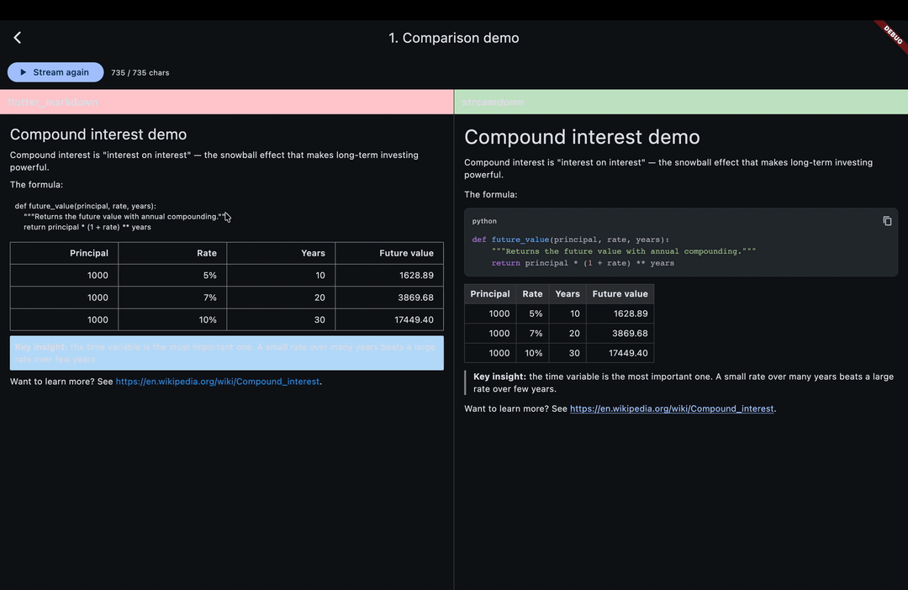

# streamdown

[](https://pub.dev/packages/streamdown)
[](https://github.com/jayu1023/streamdown/actions/workflows/ci.yml)
[](LICENSE)

**Flicker-free streaming markdown renderer for Flutter AI apps.**

A drop-in replacement for `flutter_markdown` that handles partial code fences, half-finished tables, and mid-stream LaTeX without re-parsing the prefix on every chunk. Built for ChatGPT-style apps where every token counts.



> 📦 **Status:** functional, pre-release. All 🔴 features implemented. See [`TRACKER.md`](TRACKER.md) for the live build log.

---

## Why streamdown?

`flutter_markdown` re-parses the entire string on every chunk. For a 2000-token GPT response, that's ~400 re-parses + full re-highlight of code blocks + LaTeX re-renders. Result: visible flicker, jumping cursor, code blocks that flash unstyled → styled.

**streamdown** keeps an append-only AST, renders incomplete blocks provisionally (e.g., a half-finished ` ```dart ` becomes a code block immediately), and uses stable widget keys so Flutter's diff doesn't tear down + rebuild on every token.

|  | `flutter_markdown` | `streamdown` |
|---|---|---|
| Re-parse on every chunk | ✅ (slow) | ❌ (incremental) |
| Provisional code fence rendering | ❌ | ✅ |
| Provisional table rows | ❌ | ✅ |
| Stable widget keys during stream | ❌ | ✅ |
| Per-line syntax highlighting cache | ❌ | ✅ |
| LaTeX (optional) | ✅ | ✅ |
| Bundle size | ~80KB | <50KB |

**Headline benchmark** — 5KB markdown, 4-char chunks (typical AI stream cadence): streamdown is **~188× faster** than re-parsing from scratch on every chunk. See [`test/perf/benchmark_test.dart`](test/perf/benchmark_test.dart).

---

## Install

```yaml
dependencies:
  streamdown: ^0.0.1
```

---

## Basic usage

```dart
import 'package:streamdown/streamdown.dart';

// Streaming (typical AI chat use case)
Streamdown(stream: openai.responseStream)

// Static (non-stream) markdown
Streamdown.text(fullMarkdownString)
```

That's it. Theme, code highlighting, link tap, and selectable text Just Work out of the box.

---

## Advanced usage

```dart
Streamdown(
  stream: openai.responseStream,
  syntaxTheme: SyntaxTheme.githubDark,
  latex: true,
  selectable: true,
  onLinkTap: (uri) => launchUrl(uri),
  codeBlockBuilder: (lang, code, isComplete) => MyCustomCodeBlock(...),
)
```

See [`example/`](example/) for six runnable scenarios including a side-by-side comparison with `flutter_markdown`.

---

## How it works

Three tricks combined:

1. **Incremental token-level parser** — new tokens extend the trailing AST node; the prefix is never re-tokenized.
2. **Provisional rendering** — an unclosed code fence renders as a code block immediately, then continues filling as lines stream in.
3. **Diff-stable widget keys** — every AST node gets a deterministic key so Flutter's element diff doesn't tear down existing widgets.

See [the architecture notes in CLAUDE.md](CLAUDE.md#architecture-the-moat).

---

## Run the demos

```bash
git clone https://github.com/jayu1023/streamdown
cd streamdown/example
flutter run
```

Six scenarios are included:

1. **Comparison demo** — same stream rendered by `flutter_markdown` (janky) vs `streamdown` (smooth).
2. **AI chat simulator** — mocked LLM stream you can wire to your own provider.
3. **Syntax theme gallery** — `githubLight`, `atomOneDark`, and `auto` side-by-side.
4. **Custom code block builder** — replace the default with your own widget.
5. **Long-form article** — static render of a multi-section markdown doc.
6. **LaTeX math** — inline and block math via `flutter_math_fork`.

---

## Status

| Feature category | Status |
|---|---|
| Streaming engine | ✅ |
| Block-level markdown | ✅ |
| Code blocks (syntax highlighted) | ✅ |
| Tables (GFM, alignment, inline-in-cells) | ✅ |
| LaTeX (behind `latex: true` flag) | ✅ |
| Example app | ✅ |
| Hero demo GIF | 🚧 record before publish |
| Pub.dev publish | 🎯 Phase 9 |

See [`TRACKER.md`](TRACKER.md) for live status.

---

## Contributing

Issues and PRs welcome. See [GitHub Issues](https://github.com/jayu1023/streamdown/issues).

## License

BSD-3-Clause. See [LICENSE](LICENSE).
